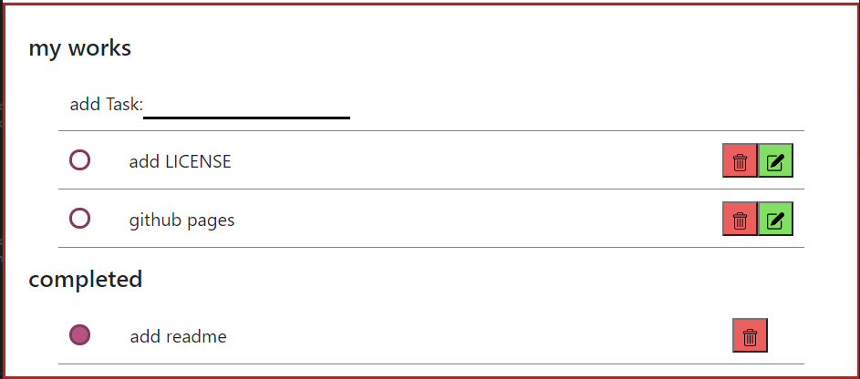

<!-- PROJECT LOGO -->
<br />
<p align="center">
  <a href="https://github.com/fatemehMirabdollahi/to-do">
    
  </a>

  <h3 align="center">to-do</h3>

  <p align="center">
    a simple to-do ui
    <br />
    <a href="https://github.com/fatemehMirabdollahi/to-do"><strong>Explore the docs »</strong></a>
    <br />
    <br />
    <a href="https://github.com/fatemehMirabdollahi/to-do/issues">Report Bug</a>
    ·
    <a href="https://github.com/fatemehMirabdollahi/to-do/issues">Request Feature</a>
  </p>
</p>


<!-- TABLE OF CONTENTS -->
<details open="open">
  <summary>Table of Contents</summary>
  <ol>
    <li>
      <a href="#about-the-project">About The Project</a>
      <ul>
        <li><a href="#built-with">Built With</a></li>
      </ul>
    </li>
    <li>
       <li><a href="#prerequisites">Prerequisites</a></li>
      <a href="#getting-started">Getting Started</a>
      <ul>
        <li><a href="#installation">Installation</a></li>
      </ul>
    </li>
    <li><a href="#usage">Usage</a></li>
  </ol>
</details>


<!-- ABOUT THE PROJECT -->
## About The Project
</br>
<p align="center">

</p>
</br>
It is a simple to-do frontend project that help you organize your daily tasks .

some note :)

* defferent to-do apps are availble but i want to practice programing on something that i will use.
* feature will be added as i need them.

### Built With

* [Javascript](www.javascript.com)
* [Vue js](Vue.jsvuejs.org)
* [Sass](https://sass-lang.com/)


<!-- GETTING STARTED -->
## Getting Started

### Prerequisites

This is the list of things you need to use and how to install them.
    <br />

* npm
    <br />

  ```sh
  npm install npm@latest -g
  ```

### Installation

1. Clone the repo
    <br />

   ```sh
   git clone https://github.com/fatemehMirabdollahi/to-do.git
   ```
2. Install NPM packages
    <br />

   ```sh
   npm install
   ```


<!-- USAGE EXAMPLES -->
## Usage

  in this app you can add your tasks and set the done and undone  with the bullets near each task, also each task has edit and delete button.


<!-- CONTACT -->
## Contact

Fatemeh mirabdollahi - fatemeh.1378.mir@gmail.com

Project Link: [https://github.com/fatemehMirabdollahi/to-do](https://github.com/fatemehMirabdollahi/to-do)
